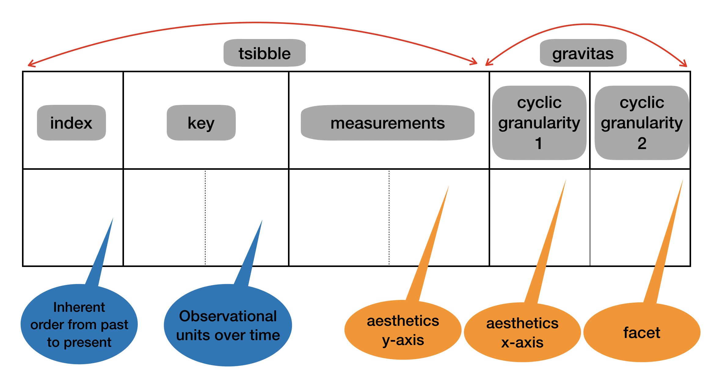

```{r setup1, include=FALSE}
knitr::opts_chunk$set(echo = FALSE, message=FALSE, warning=FALSE, cache=TRUE,
  dev.args=list(bg=grey(0.9), pointsize=11))
knitr::read_chunk('R/main.R')      
```

.animated.bounce[

]

## Visualizing probability distributions across bivariate cyclic temporal granularities

---

# Cyclic time granularities

Explore periodicities

.pull-left[
Hierarchy
<table style="border-collapse:collapse;border-spacing:0" class="tg"><thead><tr><th style="border-color:black;border-style:solid;border-width:1px;font-family:Arial, sans-serif;font-size:14px;font-weight:normal;overflow:hidden;padding:10px 5px;text-align:left;vertical-align:top;word-break:normal">half-hour</th></tr></thead><tbody><tr><td style="border-color:black;border-style:solid;border-width:1px;font-family:Arial, sans-serif;font-size:14px;overflow:hidden;padding:10px 5px;text-align:left;vertical-align:top;word-break:normal">hour</td></tr><tr><td style="border-color:black;border-style:solid;border-width:1px;font-family:Arial, sans-serif;font-size:14px;overflow:hidden;padding:10px 5px;text-align:left;vertical-align:top;word-break:normal">day</td></tr><tr><td style="border-color:black;border-style:solid;border-width:1px;font-family:Arial, sans-serif;font-size:14px;overflow:hidden;padding:10px 5px;text-align:left;vertical-align:top;word-break:normal">week</td></tr><tr><td style="border-color:black;border-style:solid;border-width:1px;font-family:Arial, sans-serif;font-size:14px;overflow:hidden;padding:10px 5px;text-align:left;vertical-align:top;word-break:normal">month</td></tr><tr><td style="border-color:black;border-style:solid;border-width:1px;font-family:Arial, sans-serif;font-size:14px;overflow:hidden;padding:10px 5px;text-align:left;vertical-align:top;word-break:normal">semester</td></tr></tbody></table>
]

.pull-right[

- single-order-up 
<br> .smaller[e.g. hour-of-day, day-of-month]
- mutliple-order-up
<br> .smaller[e.g. hour-of-week, day-of-semester]
]
---
class:center, top

# Data structure and Graphical mapping



.footnote[
.smaller[
.smaller[
Wang, Earo, Dianne Cook, and Rob J. Hyndman. 2019.<br> “A New Tidy Data Structure to Support Exploration and Modeling of Temporal Data.”]
]
]
---


# gravitas (What gravitas does)

 * Computation of cyclic granularities
 * Data structure 
   * tsibble data structure
   * harmonies and clashes
 * Mapping data structure to visualization
---

# Choosing harmonies based on the Shannon Entropy 

 * Give four graphs to show what you mean?
 * Ask them to rank these four graphs? Given a choice which ones you would want to see?
---

## Main idea - MMPD

```{r question}
```

---
 * Gestalt theory
 * if pairwise dissimilarity between distributions is more, graph is more interesting
 * Median Maximum pairwise distance

---

## Normalization

 
 * Maximum is more if number of levels is more
 * Distribution of maximum
 * norming constant depend on underlying distribution of distances
 * Median goes at the rate of log(n) as n goes to infinity
---

## Choosing threshold

---

## Will MMPD give the uniform best harmory in all situations? When will fail/succeed?

---
## Examples
